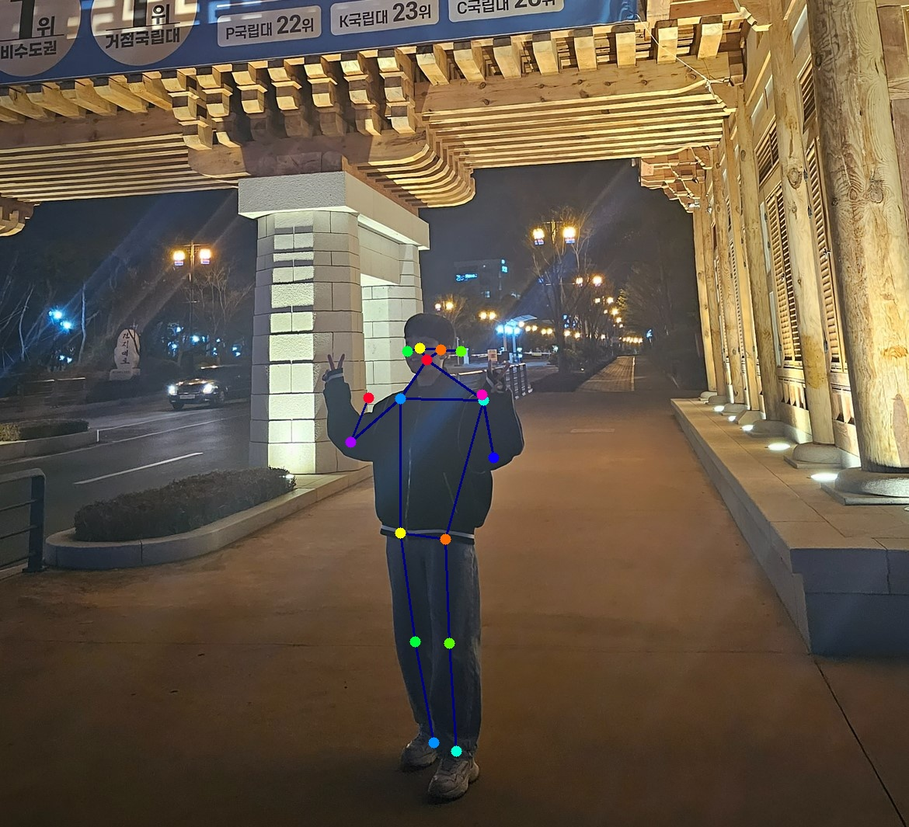

# ViTPose (simple version w/o mmcv)
An unofficial implementation of `ViTPose` [Y. Xu et al., 2022] <br>


## Usage
### | **Inference**

image
```
python inference.py --image-path './examples/img1.jpg'
```
image를 실행할경우 inference.py 파일을 사용하면 됩니다.

video
```
python pose_estimation.py --video-path examples/sample.mp4

```
video를 실행할 경우 pose_estimation.py를 실행하면 됩니다.


### | **Training**
```
python train.py --config-path config.yaml --model-name 'b'
```
- `model_name` must be in (`b`, `l`, `h`)


## Note
1.  Download the trained model (.pth)
    - [ViTPose-B-Multi-COCO.pth](https://1drv.ms/u/s!AimBgYV7JjTlgSrlMB093JzJtqq-?e=Jr5S3R)
    - [ViTPose-L-Multi-COCO.pth](https://1drv.ms/u/s!AimBgYV7JjTlgTBm3dCVmBUbHYT6?e=fHUrTq)
    - [ViTPose-H-Multi-COCO.pth](https://1drv.ms/u/s!AimBgYV7JjTlgS5rLeRAJiWobCdh?e=41GsDd)
2. Set the config. according to the trained model
    - [ViTPose-B-COCO-256x192](/Users/jaehyun/workspace/ViTPose_pytorch/configs/ViTPose_base_coco_256x192.py) 
    - [ViTPose-L-COCO-256x192](/Users/jaehyun/workspace/ViTPose_pytorch/configs/ViTPose_large_coco_256x192.py) 
    - [ViTPose-H-COCO-256x192](/Users/jaehyun/workspace/ViTPose_pytorch/configs/ViTPose_huge_coco_256x192.py) 

---
## Reference
All codes were written with reference to [the official ViTPose repo.](https://github.com/ViTAE-Transformer/ViTPose)


ViTPose-B-Multi-COCO.pth 를 다운받아서  runs폴더안에 넣어야합니다.

examples파일안에 이미지나 비디오를 넣으면 이미지는 examples폴더안에 -result라는 파일명이 붙어서 출력되고, 비디오는 video라는 폴더안에 결과 비디오가 생성되게됩니다.

그리고 이미지를 입력할때 크기는 상관없지만 현재코드는 ".jpg"파일만 동작추정이 가능하고, 비디오는 mp4형식만 가능합니다 이외에 흑백이미지든 컬러이미지든, 이미지 크기에 상관없이 입력가능합니다.